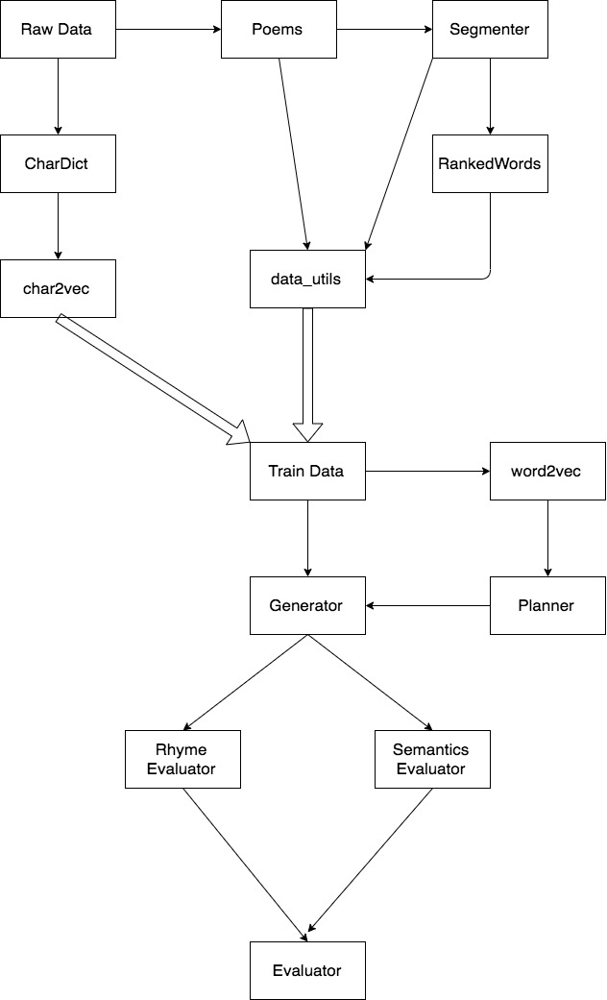

# Classical Chinese Poetry Generator based on a RNN-based Encoder-Decoder Model

A planning-based architecture is implemented based on [Wang et al. 2016](https://arxiv.org/abs/1610.09889).  
The preprocess code are adapted from https://github.com/DevinZ1993/Chinese-Poetry-Generation.

## Code Organization

## Example Result

Please aware that the model files are not include in this repo as its large size. Please train the model first when you want to test the reuslt.  

Input: 东风 (East Wind)  
Keywords:  人(human), 今日(today), 东风(east wind), 人间(the world)  
  
趁月春行尽愁人, (Walking alone under the moonlight in spring is depressing.)  
今日逐令此不听. (The excuse of leaving sounds harsh today.)  
莫说东风谢乡愁,  (Do not say the east wind can relive the nostalgia.)  
忆教人间世间醒. (Look back to my life and finally come to realize the truth of the world.)

## Dependencies

* Python 3.7

* [Numpy](http://www.numpy.org/)

* [TensorFlow2](https://www.tensorflow.org/)

* [Jieba](https://github.com/fxsjy/jieba)

* [Gensim](https://radimrehurek.com/gensim/)

## Data Processing

Run the following command to generate training data from source text data:

    ./data_utils.py

## Training

Train the planner:

    ./train.py -p

Train the generator:

    ./train.py -g

Train the both models altogether:

    ./train.py -a

To erase all trained models, run:

    ./train.py --clean

The average loss will converge at ~3.8.

## Generating

Please type in a hint text in Chinese, it should return a quatrain poem.

    ./main.py

## Possible Future Work

* Apply a new method to better tuning rhythm and tone. Our current implementation is to penalize the probability of selecting character that is out of the rhythm in the generating process.
* Implement BERT instead of bidirectional RNN.

